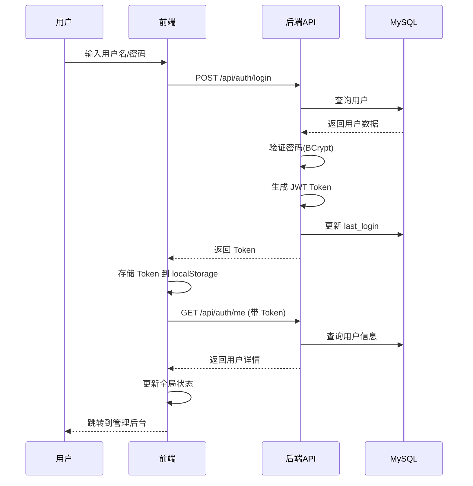
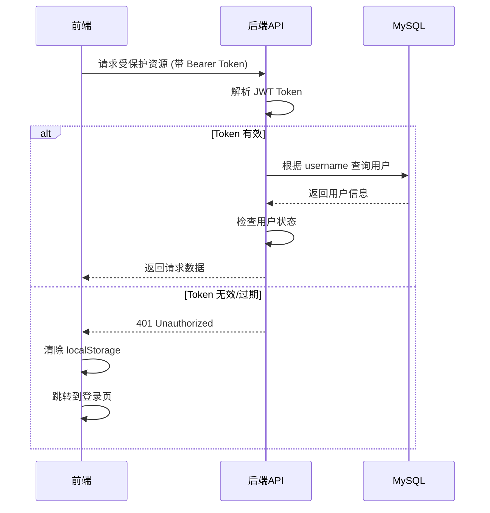

# 汪峰粉丝网站 - 用户登录系统完整方案

## 📋 目录

1. [系统概述](#系统概述)
2. [技术架构](#技术架构)
3. [数据存储](#数据存储)
4. [认证流程](#认证流程)
5. [用户角色与权限](#用户角色与权限)
6. [API 接口](#api-接口)
7. [前端实现](#前端实现)
8. [安全机制](#安全机制)
9. [部署与初始化](#部署与初始化)
10. [常见问题排查](#常见问题排查)

---

## 系统概述

本系统采用 **JWT (JSON Web Token)** 认证机制，实现基于角色的访问控制（RBAC）。所有用户数据存储在 **MySQL 数据库**中，不使用任何本地文件存储或模拟数据。

### 核心特性

- ✅ 纯 MySQL 数据库存储
- ✅ JWT Token 认证
- ✅ BCrypt 密码加密
- ✅ 基于角色的权限控制
- ✅ Token 自动刷新机制
- ✅ 安全的密码重置
- ✅ 邮箱验证支持

---

## 技术架构

### 后端技术栈

| 组件 | 技术 | 说明 |
|------|------|------|
| 框架 | FastAPI | 现代、高性能的 Python Web 框架 |
| 数据库 | MySQL 8.0+ | 关系型数据库 |
| ORM | SQLAlchemy | Python SQL 工具包和 ORM |
| 认证 | JWT | JSON Web Token 认证 |
| 密码加密 | BCrypt | 行业标准密码哈希算法 |
| 数据库连接池 | PyMySQL | Python MySQL 客户端 |

### 前端技术栈

| 组件 | 技术 | 说明 |
|------|------|------|
| 框架 | React 18 | 用户界面库 |
| 路由 | React Router | 客户端路由 |
| 状态管理 | Context API | 全局认证状态管理 |
| HTTP 客户端 | Fetch API | 原生 HTTP 请求 |
| 本地存储 | localStorage | Token 和用户信息缓存 |

---

## 数据存储

### MySQL 数据库配置

**数据库连接信息**（`backend/app/database.py`）：

```python
DATABASE_USER = "root"
DATABASE_PASSWORD = "123456"
DATABASE_HOST = "localhost"
DATABASE_PORT = "3306"
DATABASE_NAME = "wangfeng_fan_website"
```

可通过环境变量覆盖：

```bash
export DATABASE_USER=your_user
export DATABASE_PASSWORD=your_password
export DATABASE_HOST=localhost
export DATABASE_PORT=3306
export DATABASE_NAME=wangfeng_fan_website
```

### 用户表结构

**表名**: `users`

| 字段名 | 类型 | 约束 | 说明 |
|--------|------|------|------|
| id | INTEGER | PRIMARY KEY, AUTO_INCREMENT | 用户唯一标识 |
| username | VARCHAR(50) | UNIQUE, NOT NULL, INDEX | 用户名（支持中文） |
| email | VARCHAR(100) | UNIQUE, NOT NULL, INDEX | 邮箱地址 |
| hashed_password | VARCHAR(255) | NOT NULL | BCrypt 加密后的密码 |
| avatar | VARCHAR(500) | NULLABLE | 头像路径 |
| role | VARCHAR(20) | NOT NULL, DEFAULT='user', INDEX | 用户角色 |
| is_active | BOOLEAN | NOT NULL, DEFAULT=TRUE | 账户是否激活 |
| status | VARCHAR(20) | NOT NULL, DEFAULT='active', INDEX | 用户状态 |
| created_at | DATETIME | NOT NULL, DEFAULT=CURRENT_TIMESTAMP | 创建时间 |
| updated_at | DATETIME | NOT NULL, ON UPDATE | 更新时间 |
| last_login | DATETIME | NULLABLE | 最后登录时间 |

**SQLAlchemy 模型**（`backend/app/models/user_db.py`）：

```python
class User(Base):
    __tablename__ = "users"

    id = Column(Integer, primary_key=True, autoincrement=True, index=True)
    username = Column(String(50), unique=True, nullable=False, index=True)
    email = Column(String(100), unique=True, nullable=False, index=True)
    hashed_password = Column(String(255), nullable=False)
    avatar = Column(String(500), nullable=True)
    role = Column(String(20), default="user", nullable=False, index=True)
    is_active = Column(Boolean, default=True, nullable=False)
    status = Column(String(20), default="active", nullable=False, index=True)
    created_at = Column(DateTime, default=datetime.utcnow, nullable=False)
    updated_at = Column(DateTime, default=datetime.utcnow, onupdate=datetime.utcnow)
    last_login = Column(DateTime, nullable=True)
```

---

## 认证流程

### 1. 用户登录流程



### 2. Token 验证流程



### 3. 密码加密机制

使用 **BCrypt** 算法进行密码加密（`backend/app/core/security.py`）：

```python
import bcrypt

def get_password_hash(password: str) -> str:
    """生成密码哈希"""
    password_bytes = password.encode('utf-8')
    if len(password_bytes) > 72:
        password_bytes = password_bytes[:72]  # BCrypt 限制

    salt = bcrypt.gensalt()
    hashed = bcrypt.hashpw(password_bytes, salt)
    return hashed.decode('utf-8')

def verify_password(plain_password: str, hashed_password: str) -> bool:
    """验证密码"""
    return bcrypt.checkpw(
        plain_password.encode('utf-8'),
        hashed_password.encode('utf-8')
    )
```

### 4. JWT Token 生成

**Token 配置**（`backend/app/core/config.py`）：

```python
SECRET_KEY = "your-secret-key-here"  # 生产环境必须更换
ALGORITHM = "HS256"
ACCESS_TOKEN_EXPIRE_MINUTES = 10080  # 7 天
```

**Token 生成函数**（`backend/app/core/security.py`）：

```python
import jwt
from datetime import datetime, timedelta

def create_access_token(data: dict, expires_delta: timedelta = None):
    """创建访问令牌"""
    to_encode = data.copy()
    if expires_delta:
        expire = datetime.utcnow() + expires_delta
    else:
        expire = datetime.utcnow() + timedelta(minutes=15)

    to_encode.update({"exp": expire})
    encoded_jwt = jwt.encode(to_encode, SECRET_KEY, algorithm=ALGORITHM)
    return encoded_jwt
```

---

## 用户角色与权限

### 角色定义

系统支持四种用户角色（`backend/app/models/roles.py`）：

| 角色 | 值 | 权限等级 | 说明 |
|------|-----|----------|------|
| 游客 | guest | 0 | 未登录用户，只读权限 |
| 普通用户 | user | 1 | 已注册用户，可评论、点赞 |
| 管理员 | admin | 2 | 内容管理权限 |
| 超级管理员 | super_admin | 3 | 完全控制权限 |

### 权限等级

```python
class UserRole(str, enum.Enum):
    GUEST = "guest"
    USER = "user"
    ADMIN = "admin"
    SUPER_ADMIN = "super_admin"

def get_hierarchy(role: UserRole) -> int:
    hierarchy = {
        UserRole.GUEST: 0,
        UserRole.USER: 1,
        UserRole.ADMIN: 2,
        UserRole.SUPER_ADMIN: 3
    }
    return hierarchy.get(role, 0)
```

### 权限检查

**后端权限依赖**（`backend/app/core/dependencies.py`）：

```python
def get_current_active_user(current_user: User = Depends(get_current_user)) -> User:
    """获取当前活跃用户"""
    if not current_user.is_active:
        raise HTTPException(status_code=400, detail="用户已被禁用")
    return current_user
```

**前端权限检查**（`frontend/src/contexts/AuthContext.tsx`）：

```typescript
export const hasPermission = (userRole: UserRole, requiredRole: UserRole): boolean => {
  return getRoleHierarchy(userRole) >= getRoleHierarchy(requiredRole);
};

// 使用示例
const { hasPermission } = useAuth();

if (hasPermission('admin')) {
  // 显示管理功能
}
```

---

## API 接口

### 认证相关接口

#### 1. 用户登录

**端点**: `POST /api/auth/login`

**请求体**:
```json
{
  "username": "忧郁的眼睛o",
  "password": "123456"
}
```

**响应**:
```json
{
  "access_token": "eyJhbGciOiJIUzI1NiIsInR5cCI6IkpXVCJ9...",
  "token_type": "bearer"
}
```

**实现代码**（`backend/app/routers/auth.py`）:

```python
@router.post("/login", response_model=Token)
def login(
    user_data: UserLogin,
    user_service: UserServiceMySQL = Depends(get_user_service)
):
    """用户登录"""
    user = user_service.authenticate_user(user_data.username, user_data.password)

    if not user:
        raise HTTPException(
            status_code=status.HTTP_401_UNAUTHORIZED,
            detail="用户名或密码错误",
            headers={"WWW-Authenticate": "Bearer"},
        )

    if not user.is_active:
        raise HTTPException(
            status_code=status.HTTP_400_BAD_REQUEST,
            detail="用户已被禁用"
        )

    # 更新最后登录时间
    user_service.update_user_last_login(user.id)

    # 创建访问令牌
    access_token_expires = timedelta(minutes=settings.access_token_expire_minutes)
    access_token = create_access_token(
        data={"sub": user.username}, expires_delta=access_token_expires
    )

    return {
        "access_token": access_token,
        "token_type": "bearer"
    }
```

#### 2. 获取当前用户信息

**端点**: `GET /api/auth/me`

**请求头**:
```
Authorization: Bearer <access_token>
```

**响应**:
```json
{
  "id": 1,
  "username": "忧郁的眼睛o",
  "email": "511186155@qq.com",
  "role": "super_admin",
  "role_name": "超级管理员",
  "is_active": true
}
```

#### 3. 用户注册

**端点**: `POST /api/auth/register`

**请求体**:
```json
{
  "username": "新用户",
  "email": "user@example.com",
  "password": "password123",
  "full_name": "全名（可选）"
}
```

**响应**:
```json
{
  "id": 2,
  "username": "新用户",
  "email": "user@example.com",
  "role": "user",
  "role_name": "普通用户",
  "is_active": true
}
```

#### 4. 初始化超级管理员

**端点**: `POST /api/auth/init-super-admin`

**请求体**: 无

**响应**:
```json
{
  "id": 1,
  "username": "root",
  "email": "root@wangfeng.fan",
  "role": "super_admin",
  "role_name": "超级管理员",
  "is_active": true
}
```

**说明**: 此接口仅在系统中不存在超级管理员时可用，创建用户名为 `root`，密码为 `123456` 的超级管理员。

---

## 前端实现

### AuthContext 全局状态

**文件**: `frontend/src/contexts/AuthContext.tsx`

```typescript
export interface User {
  id: number;
  username: string;
  email: string;
  role: UserRole;
  role_name: string;
  is_active: boolean;
}

export interface AuthContextType {
  user: User | null;
  token: string | null;
  currentRole: UserRole;
  login: (username: string, password: string) => Promise<void>;
  logout: () => void;
  isLoading: boolean;
  hasPermission: (requiredRole: UserRole) => boolean;
}
```

### 登录流程实现

```typescript
const login = async (username: string, password: string) => {
  try {
    // 1. 调用登录接口
    const response = await fetch(`${API_BASE_URL}/api/auth/login`, {
      method: 'POST',
      headers: { 'Content-Type': 'application/json' },
      body: JSON.stringify({ username, password }),
    });

    if (!response.ok) {
      const error = await response.json();
      throw new Error(error.detail || '登录失败');
    }

    const data = await response.json();
    const authToken = data.access_token;

    // 2. 获取用户信息
    const userResponse = await fetch(`${API_BASE_URL}/api/auth/me`, {
      headers: { 'Authorization': `Bearer ${authToken}` },
    });

    if (!userResponse.ok) {
      throw new Error('获取用户信息失败');
    }

    const userData = await userResponse.json();

    // 3. 保存到状态和 localStorage
    setToken(authToken);
    setUser(userData);
    localStorage.setItem('access_token', authToken);
    localStorage.setItem('token', authToken); // 兼容旧代码
    localStorage.setItem('user', JSON.stringify(userData));
  } catch (error) {
    console.error('登录失败:', error);
    throw error;
  }
};
```

### 登录页面组件

**文件**: `frontend/src/components/admin/AdminLogin.tsx`

核心功能：
- 用户名/密码输入
- 密码显示/隐藏切换
- 错误提示
- 加载状态
- 登录成功后跳转到 `/admin/dashboard`

```typescript
const handleSubmit = async (e: React.FormEvent) => {
  e.preventDefault();
  setError('');
  setLoading(true);

  try {
    await login(username, password);
    navigate('/admin/dashboard');
  } catch (err) {
    setError(err instanceof Error ? err.message : '登录失败，请检查用户名和密码');
  } finally {
    setLoading(false);
  }
};
```

### 受保护路由

使用 `ProtectedRoute` 组件包裹需要认证的页面：

```typescript
function ProtectedRoute({ children, requiredRole = 'user' }: ProtectedRouteProps) {
  const { user, isLoading, hasPermission } = useAuth();

  if (isLoading) {
    return <div>加载中...</div>;
  }

  if (!user || !hasPermission(requiredRole)) {
    return <Navigate to="/admin/login" replace />;
  }

  return <>{children}</>;
}
```

---

## 安全机制

### 1. 密码安全

- ✅ 使用 BCrypt 加密（cost factor = 12）
- ✅ 密码长度限制（最大 72 字节）
- ✅ 不在日志或错误信息中暴露密码
- ✅ 密码哈希不可逆

### 2. Token 安全

- ✅ JWT 签名验证
- ✅ Token 过期时间：7 天
- ✅ Token 存储在 localStorage（仅客户端访问）
- ✅ 每次请求通过 `Authorization: Bearer` 头传递
- ✅ 服务端验证 Token 有效性

### 3. API 安全

- ✅ CORS 配置限制允许的来源
- ✅ 请求体大小限制（50MB）
- ✅ 基于角色的访问控制（RBAC）
- ✅ 数据库连接池管理
- ✅ SQL 注入防护（SQLAlchemy ORM）

### 4. 数据库安全

- ✅ 密码加密存储
- ✅ 使用 ORM 防止 SQL 注入
- ✅ 数据库连接池配置
- ✅ 自动连接健康检查
- ✅ 事务管理和回滚

---

## 部署与初始化

### 前置条件

1. **MySQL 数据库**
   ```bash
   # 创建数据库
   mysql -u root -p
   CREATE DATABASE wangfeng_fan_website CHARACTER SET utf8mb4 COLLATE utf8mb4_unicode_ci;
   ```

2. **Python 环境**
   ```bash
   cd backend
   python3 -m venv .venv
   source .venv/bin/activate  # macOS/Linux
   # .venv\Scripts\activate  # Windows
   pip install -r requirements.txt
   ```

### 初始化步骤

#### 1. 创建数据库表

后端启动时会自动创建所有表（`backend/app/main.py`）：

```python
from .models.user_db import Base as UserBase
from .database import engine

# 创建所有数据库表
UserBase.metadata.create_all(bind=engine)
```

或手动执行：

```bash
cd backend
python3 -c "from app.database import engine; from app.models.user_db import Base; Base.metadata.create_all(bind=engine)"
```

#### 2. 初始化超级管理员

**方法一：使用初始化脚本（推荐）**

```bash
cd backend
python3 init_super_admin.py
```

输出：
```
初始化超级管理员账户...
✅ 超级管理员创建成功！
============================================================
用户名: 忧郁的眼睛o
邮箱: 511186155@qq.com
密码: 123456
角色: super_admin
============================================================
```

**方法二：使用 API 接口**

```bash
curl -X POST http://localhost:1994/api/auth/init-super-admin
```

**当前超级管理员账户**：
- **用户名**: `忧郁的眼睛o`
- **邮箱**: `511186155@qq.com`
- **密码**: `123456`
- **角色**: `super_admin`

#### 3. 启动服务

**后端**:
```bash
cd backend
python3 start.py
# 或
uvicorn app.main:app --host 0.0.0.0 --port 1994 --reload
```

**前端**:
```bash
cd frontend
pnpm dev
```

#### 4. 访问登录页面

打开浏览器访问：
```
http://localhost:1997/#/admin/login
```

使用超级管理员账户登录。

---

## 常见问题排查

### 问题 1: 登录失败 - "用户名或密码错误"

**可能原因**:
1. ❌ 密码错误
2. ❌ MySQL 中没有该用户
3. ❌ 密码哈希不匹配

**解决方法**:

```bash
# 1. 检查数据库中的用户
mysql -u root -p
USE wangfeng_fan_website;
SELECT id, username, email, role, is_active FROM users;

# 2. 重置超级管理员密码
cd backend
python3 init_super_admin.py
```

### 问题 2: 401 Unauthorized

**可能原因**:
1. ❌ Token 已过期
2. ❌ Token 格式错误
3. ❌ 用户已被禁用

**解决方法**:

```typescript
// 前端：清除本地存储并重新登录
localStorage.removeItem('access_token');
localStorage.removeItem('token');
localStorage.removeItem('user');
window.location.href = '/#/admin/login';
```

### 问题 3: 数据库连接失败

**可能原因**:
1. ❌ MySQL 服务未启动
2. ❌ 数据库配置错误
3. ❌ 数据库不存在

**解决方法**:

```bash
# 1. 检查 MySQL 服务状态
mysql --version
mysql -u root -p -e "SHOW DATABASES;"

# 2. 检查数据库连接配置
cat backend/app/database.py

# 3. 创建数据库（如果不存在）
mysql -u root -p -e "CREATE DATABASE wangfeng_fan_website CHARACTER SET utf8mb4 COLLATE utf8mb4_unicode_ci;"
```

### 问题 4: CORS 错误

**可能原因**:
前端地址不在后端 CORS 允许列表中

**解决方法**:

编辑 `backend/app/main.py`:

```python
app.add_middleware(
    CORSMiddleware,
    allow_origins=[
        "http://localhost:1997",  # 添加你的前端地址
        "http://127.0.0.1:1997",
    ],
    allow_credentials=True,
    allow_methods=["*"],
    allow_headers=["*"],
)
```

### 问题 5: Token 存储丢失

**可能原因**:
浏览器隐私模式或清除了 localStorage

**解决方法**:

前端增加 Token 持久化检查：

```typescript
useEffect(() => {
  const savedToken = localStorage.getItem('access_token');
  const savedUser = localStorage.getItem('user');

  if (savedToken && savedUser) {
    setToken(savedToken);
    setUser(JSON.parse(savedUser));
  }
}, []);
```

---

## 附录

### A. 文件结构

```
backend/
├── app/
│   ├── core/
│   │   ├── config.py          # 配置文件
│   │   ├── security.py        # 安全相关（密码加密、JWT）
│   │   └── dependencies.py    # 依赖注入
│   ├── models/
│   │   ├── user_db.py         # 用户 SQLAlchemy 模型
│   │   └── roles.py           # 角色定义
│   ├── routers/
│   │   └── auth.py            # 认证路由
│   ├── schemas/
│   │   └── user.py            # Pydantic 模型
│   ├── services/
│   │   └── user_service_mysql.py  # 用户服务
│   ├── database.py            # 数据库连接
│   └── main.py                # FastAPI 应用
├── init_super_admin.py        # 初始化脚本
└── requirements.txt           # Python 依赖

frontend/
├── src/
│   ├── components/
│   │   └── admin/
│   │       └── AdminLogin.tsx # 登录页面
│   ├── contexts/
│   │   └── AuthContext.tsx    # 认证上下文
│   └── utils/
│       └── api.ts             # API 工具函数
```

### B. 依赖清单

**后端**:
```txt
fastapi
uvicorn
sqlalchemy
pymysql
bcrypt
pyjwt
python-multipart
```

**前端**:
```json
{
  "react": "^18.0.0",
  "react-router-dom": "^6.0.0",
  "framer-motion": "^10.0.0"
}
```

### C. 环境变量

创建 `backend/.env` 文件：

```env
DATABASE_USER=root
DATABASE_PASSWORD=123456
DATABASE_HOST=localhost
DATABASE_PORT=3306
DATABASE_NAME=wangfeng_fan_website
SECRET_KEY=your-secret-key-change-in-production
ACCESS_TOKEN_EXPIRE_MINUTES=10080
```

---

## 总结

本用户登录系统完全基于 **MySQL 数据库**，不使用任何本地文件或模拟数据。采用业界标准的 **JWT + BCrypt** 认证方案，支持完整的用户管理功能和基于角色的权限控制。

**核心优势**：
- ✅ 纯数据库存储，数据安全可靠
- ✅ JWT 无状态认证，易于扩展
- ✅ BCrypt 加密，密码安全
- ✅ 完整的权限体系
- ✅ 易于部署和维护

**当前登录凭据**：
- 用户名：`忧郁的眼睛o`
- 密码：`123456`

如需重置密码，运行：
```bash
cd backend
python3 init_super_admin.py
```

---

**文档版本**: v1.0
**最后更新**: 2025-10-15
**维护者**: Claude Code
