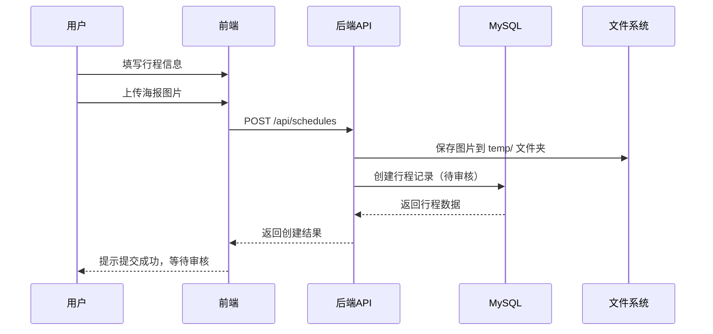
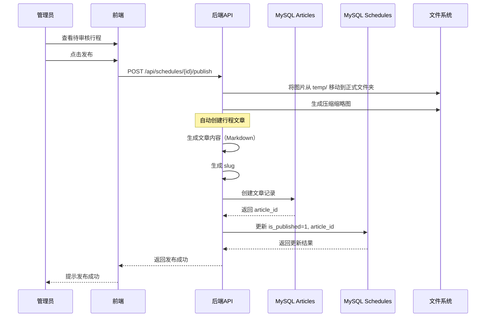
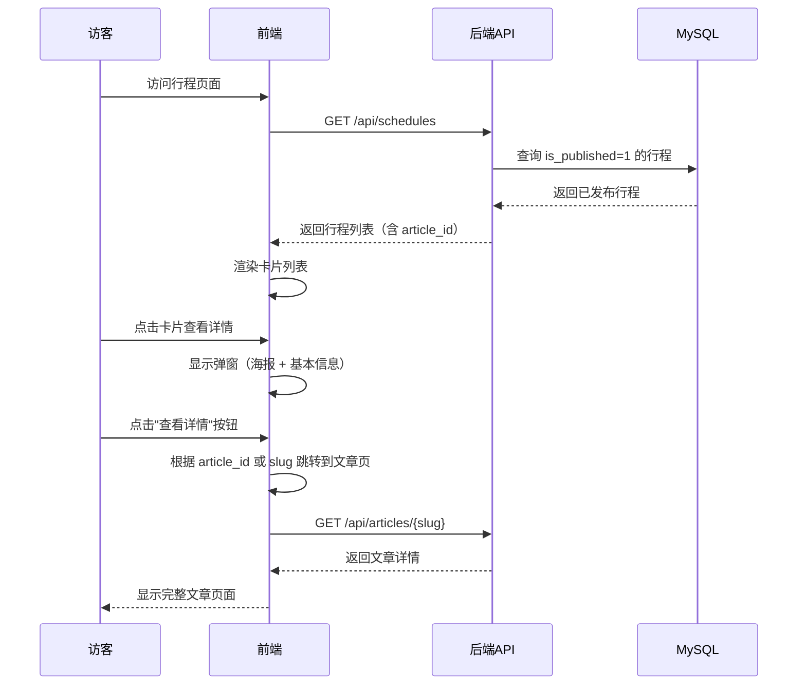

# 汪峰粉丝网站 - 行程信息实现方案

## 📋 目录

1. [系统概述](#系统概述)
2. [当前实现分析](#当前实现分析)
3. [数据存储架构](#数据存储架构)
4. [功能模块](#功能模块)
5. [API 接口](#api-接口)
6. [图片存储方案](#图片存储方案)
7. [前端实现](#前端实现)
8. [行程与文章关联](#行程与文章关联)
9. [后续规划](#后续规划)

---

## 系统概述

行程信息管理系统用于管理汪峰的演出行程，包括演唱会、音乐节、商演、综艺活动等。系统采用 **MySQL 数据库** 作为唯一数据源，所有行程数据均存储在数据库中，不使用任何本地 JSON 文件。

### 核心特性

- ✅ 纯 MySQL 数据库存储
- ✅ 支持图片上传和压缩
- ✅ 审核发布流程
- ✅ 多种行程分类
- ✅ 标签系统支持
- ✅ 图片自动压缩（缩略图）
- ✅ 行程卡片展示 + 文章详情页
- ✅ 自动生成行程信息文章

---

## 当前实现分析

### 1. 数据存储现状

#### ✅ 已实现：MySQL 存储
- **数据库表**: `schedules`
- **服务类**: `ScheduleServiceMySQL`
- **路由**: `/api/schedules`

### 2. 当前功能实现

| 功能 | 状态 | 说明 |
|------|------|------|
| 行程创建 | ✅ 已实现 | 用户提交后待审核 |
| 行程列表 | ✅ 已实现 | 仅显示已发布的行程 |
| 行程审核 | ✅ 已实现 | 管理员审核发布 |
| 图片上传 | ✅ 已实现 | 支持原图和缩略图 |
| 图片压缩 | ✅ 已实现 | 自动生成 200KB 以下缩略图 |
| 行程更新 | ✅ 已实现 | 支持修改行程信息 |
| 行程删除 | ✅ 已实现 | 物理删除 |
| 卡片展示 | ✅ 已实现 | 前端以卡片形式展示 |
| 文章详情页 | ✅ 已实现 | 自动生成行程信息文章 |
| 查看详情按钮 | ✅ 已实现 | 卡片弹窗中跳转到文章 |

---

## 数据存储架构

### MySQL 数据库表结构

**表名**: `schedules`

| 字段名 | 类型 | 约束 | 说明 |
|--------|------|------|------|
| id | INTEGER | PRIMARY KEY, AUTO_INCREMENT | 行程唯一标识 |
| category | VARCHAR(20) | NOT NULL, INDEX | 行程分类（演唱会/livehouse/音乐节/商演拼盘/综艺晚会/直播/商业活动/其他） |
| date | VARCHAR(10) | NOT NULL, INDEX | 行程日期 YYYY-MM-DD |
| city | VARCHAR(50) | NOT NULL | 城市 |
| venue | VARCHAR(200) | NULLABLE | 具体场馆/地点 |
| theme | VARCHAR(200) | NOT NULL | 行程主题/详情 |
| description | TEXT | NULLABLE | 补充说明 |
| image | VARCHAR(500) | NULLABLE | 海报图片路径（原图） |
| image_thumb | VARCHAR(500) | NULLABLE | 海报缩略图路径（压缩图） |
| tags | TEXT | NULLABLE | 标签，用逗号分隔 |
| source | VARCHAR(20) | NOT NULL, DEFAULT='custom' | 数据来源：legacy/custom |
| review_status | VARCHAR(20) | NOT NULL, DEFAULT='pending', INDEX | 审核状态: pending/approved |
| is_published | INTEGER | NOT NULL, DEFAULT=0 | 是否已发布: 0未发布/1已发布 |
| **article_id** | VARCHAR(36) | NULLABLE, INDEX | **关联的文章ID** |
| created_at | DATETIME | NOT NULL, DEFAULT=CURRENT_TIMESTAMP | 创建时间 |
| updated_at | DATETIME | NOT NULL, ON UPDATE | 更新时间 |

### SQLAlchemy 模型

**文件**: `backend/app/models/schedule_db.py`

```python
class Schedule(Base):
    __tablename__ = "schedules"

    id = Column(Integer, primary_key=True, index=True, autoincrement=True)
    category = Column(String(20), nullable=False, index=True)
    date = Column(String(10), nullable=False, index=True)
    city = Column(String(50), nullable=False)
    venue = Column(String(200), nullable=True)
    theme = Column(String(200), nullable=False)
    description = Column(Text, nullable=True)
    image = Column(String(500), nullable=True)
    image_thumb = Column(String(500), nullable=True)
    tags = Column(Text, nullable=True)
    source = Column(String(20), default='custom', nullable=False)
    review_status = Column(String(20), default='pending', nullable=False, index=True)
    is_published = Column(Integer, default=0, nullable=False)
    article_id = Column(String(36), nullable=True, index=True)  # 新增字段
    created_at = Column(DateTime, default=datetime.utcnow, nullable=False)
    updated_at = Column(DateTime, default=datetime.utcnow, onupdate=datetime.utcnow)
```

### 行程分类

行程分类在前端和后端有不同的实现方式：

**后端 Schema** (`backend/app/schemas/schedule.py`):
```python
class ScheduleCategory(str, Enum):
    concert = '演唱会'      # 个人演唱会
    festival = '音乐节'     # 音乐节演出
    commercial = '商演'     # 商业演出
    variety = '综艺活动'    # 综艺晚会
    other = '其他'          # 其他活动
```

**数据库模型** (`backend/app/models/schedule_db.py`):
- `category` 字段类型为 `String(20)`，不使用枚举约束
- 允许存储任意字符串类型的分类名称

**前端类型定义** (`frontend/src/utils/api.ts`):
```typescript
export type ScheduleCategory =
  | '演唱会'      // 个人演唱会
  | 'livehouse'   // Livehouse演出
  | '音乐节'      // 音乐节演出
  | '商演拼盘'    // 商演拼盘
  | '综艺晚会'    // 综艺晚会活动
  | '直播'        // 直播活动
  | '商业活动'    // 商业活动
  | '其他';       // 其他类型活动
```

**前端显示** (`frontend/src/components/pages/TourDates.tsx`):
```typescript
const categories: Array<'全部' | ScheduleCategory> = [
  '全部',
  '演唱会',
  'livehouse',
  '音乐节',
  '商演拼盘',
  '综艺晚会',
  '直播',
  '商业活动',
  '其他',
];
```

**说明**:
- 后端 Schema 中的枚举主要用于 API 文档和基本验证
- 数据库使用字符串类型，不强制枚举约束，提供更大的灵活性
- 前端定义了更详细的8种分类，用于精确的行程分类和筛选
- 两者之间的差异是为了保持系统的灵活性，同时满足前端展示需求

---

## 功能模块

### 1. 行程创建流程



### 2. 行程审核发布流程（含文章创建）



### 3. 前台展示流程



---

## API 接口

### 1. 获取行程列表

**端点**: `GET /api/schedules`

**说明**: 获取所有已发布的行程（前台展示）

**响应**:
```json
[
  {
    "id": 1,
    "category": "演唱会",
    "date": "2025-12-27",
    "city": "长沙",
    "venue": "贺龙体育馆",
    "theme": "汪峰"相信未来"巡回演唱会长沙站",
    "description": "门票即将开售",
    "image": "images/演唱会/2025.12.27-相信未来长沙站/海报.jpg",
    "image_thumb": "images/演唱会/2025.12.27-相信未来长沙站/海报-thumb.jpg",
    "tags": ["演唱会", "相信未来"],
    "article_id": "abc123-def456-ghi789",
    "source": "custom",
    "is_published": 1
  },
  {
    "id": 2,
    "category": "livehouse",
    "date": "2025-11-15",
    "city": "北京",
    "venue": "MAO Livehouse",
    "theme": "汪峰 Livehouse 小型演出",
    "description": "限定100人",
    "image": "images/livehouse/2025.11.15-北京站/海报.jpg",
    "image_thumb": "images/livehouse/2025.11.15-北京站/海报-thumb.jpg",
    "tags": ["livehouse", "北京"],
    "article_id": "def456-ghi789-jkl012",
    "source": "custom",
    "is_published": 1
  }
]
```

---

## 图片存储方案

### 图片存储路径结构

```
frontend/public/images/
├── temp/                                    # 临时文件夹（待审核）
│   └── 2025.12.27-相信未来长沙站-海报.jpg
├── 演唱会/
│   ├── 2025.12.27-相信未来长沙站/
│   │   ├── 2025.12.27-相信未来长沙站-海报.jpg         # 原图
│   │   └── 2025.12.27-相信未来长沙站-海报-thumb.jpg   # 缩略图
│   └── 2025.12.30-相信未来北京站/
│       ├── 2025.12.30-相信未来北京站-海报.jpg
│       └── 2025.12.30-相信未来北京站-海报-thumb.jpg
├── 音乐节/
│   └── 2025.11.15-草莓音乐节/
│       ├── 2025.11.15-草莓音乐节-海报.jpg
│       └── 2025.11.15-草莓音乐节-海报-thumb.jpg
└── 默认海报.jpg                             # 默认海报
```

---

## 前端实现

### 1. 行程卡片展示

**组件**: `frontend/src/components/pages/TourDates.tsx`

**功能**:
- 显示所有已发布的行程（`is_published=1`）
- 卡片式布局
- 显示日期、城市、主题、海报缩略图
- 点击卡片弹出详情弹窗

### 2. 行程详情弹窗

**功能**:
- 显示海报大图
- 显示基本信息（日期、城市、场馆、分类）
- 显示补充说明
- **两个按钮**：
  - **查看详情** - 跳转到行程信息文章页
  - **关闭** - 关闭弹窗

**实现代码**:
```tsx
<div className="absolute right-4 top-4 flex gap-2">
  <button
    onClick={() => {
      // 跳转到文章详情页
      const dateStr = selectedSchedule.date.replace(/-/g, '');
      const theme = selectedSchedule.theme.substring(0, 20);
      const slug = `${dateStr}-${theme}`;
      window.location.href = `/#/articles/${slug}`;
    }}
    className="px-4 py-2 rounded-lg bg-wangfeng-purple hover:bg-wangfeng-dark transition-colors text-white text-sm font-medium"
  >
    查看详情
  </button>
  <button
    onClick={() => setSelectedSchedule(null)}
    className="p-2 rounded-lg transition-colors hover:bg-white/10"
  >
    <X className="h-6 w-6 theme-text-primary" />
  </button>
</div>
```

---

## 行程与文章关联

### 1. 设计理念

**为每个行程自动创建一篇文章**：
- 文章归类在 `资料科普 > 行程信息`
- 文章标题 = 行程主题
- 文章内容使用预设模板自动生成
- 后续可在后台管理中编辑文章内容

### 2. 文章模板结构

**模板组成**:
1. **基本信息**：时间、城市、场馆、分类
2. **演出海报**：行程图片（响应式展示）
3. **补充说明**：行程描述
4. **购票信息**：预留区域（后续编辑）
5. **交通指南**：预留区域（后续编辑）

**示例文章内容**（Markdown格式）:

```markdown
## 📅 演出信息

**时间**: 2025-12-27
**城市**: 长沙
**场馆**: 贺龙体育馆
**分类**: 演唱会

---

## 🎤 演出海报


## 📝 补充说明

门票即将开售，敬请期待！

## 🎫 购票信息

> 购票信息将在售票开启后更新，请关注汪峰官方微博及各大票务平台。

## 🚗 交通指南

> 交通指南将在演出临近时更新，敬请期待。

---

*本文章由系统自动生成，内容可能不完整。如有最新消息，请以官方发布为准。*
```

### 3. 文章属性

| 属性 | 值 | 说明 |
|------|-----|------|
| **category_primary** | 资料科普 | 一级分类 |
| **category_secondary** | 行程信息 | 二级分类 |
| **author** | 汪峰官方 | 作者 |
| **is_published** | true | 默认发布 |
| **review_status** | approved | 默认已审核 |
| **tags** | [演唱会, 长沙, 演出信息] | 自动生成标签 |

### 4. Slug 生成规则

**格式**: `日期-主题前20字`

**示例**:
- 行程主题：`汪峰"相信未来"巡回演唱会长沙站`
- 日期：`2025-12-27`
- 生成的 slug：`20251227-汪峰相信未来巡回演唱会长沙站`

### 5. 创建文章示例脚本

**文件**: `backend/create_schedule_article_template.py`

**使用方法**:
```bash
cd backend
python3 create_schedule_article_template.py
```

**功能**:
- 读取指定行程ID的数据
- 根据模板生成文章内容
- 创建文章记录并存入 MySQL
- 输出访问链接

---

## 后续规划

### 阶段一：自动化行程文章创建（高优先级）

**目标**: 发布行程时自动创建文章

**实现步骤**:

1. **修改发布接口**（`backend/app/routers/schedules.py`）
   ```python
   @router.post("/{schedule_id}/publish")
   async def publish_schedule(schedule_id: int):
       # 1. 发布行程
       schedule = schedule_service.publish_schedule(schedule_id)
   
       # 2. 自动创建文章
       article = create_schedule_article(schedule)
   
       # 3. 更新行程的 article_id
       schedule_service.update_entry(schedule_id, article_id=article.id)
   
       return {"schedule": schedule, "article": article}
   ```

2. **提取文章生成逻辑为独立函数**
   - 位置：`backend/app/services/schedule_article_service.py`
   - 函数：`generate_schedule_article(schedule) -> Article`

3. **测试流程**:
   - 创建新行程
   - 发布行程
   - 验证文章是否自动创建
   - 验证 article_id 是否正确关联

### 阶段二：批量为现有行程补充文章（中优先级）

**目标**: 为100条现有行程批量创建文章

**实现脚本**: `backend/batch_create_schedule_articles.py`

**步骤**:
```python
def batch_create_articles():
    schedules = db.query(Schedule).filter(
        Schedule.is_published == 1,
        Schedule.article_id.is_(None)
    ).all()

    for schedule in schedules:
        article = create_schedule_article(schedule)
        schedule.article_id = article.id
        db.commit()
```

### 阶段三：富文本编辑器集成（低优先级）

**目标**: 后台管理支持编辑文章内容

**技术选型**:
- 推荐：`@mdxeditor/editor` （Markdown编辑器）
- 备选：`react-quill` （富文本编辑器）

**功能**:
- 编辑自动生成的文章内容
- 添加更多演出信息
- 插入图片
- 格式化文本

---

## 总结

### 当前状态

✅ **已完成**:
- 所有行程数据存储在 MySQL 数据库中
- 不使用任何本地 JSON 文件
- 图片上传和压缩功能完善
- 审核发布流程完整
- 前端卡片展示功能正常
- 行程卡片弹窗支持"查看详情"和"关闭"两个按钮
- 文章模板已创建，可手动生成行程信息文章
- schedules 表已添加 article_id 字段

### 已废弃内容

❌ **不再使用**:
- `backend/data/schedule_entries.json` - 本地 JSON 存储（已删除）
- `backend/app/services/schedule_service.py` - 旧的服务类（已删除）

### 后续工作

📋 **待实现**:
1. **高优先级**: 发布行程时自动创建文章
2. **中优先级**: 批量为现有100条行程补充文章
3. **低优先级**: 富文本编辑器支持编辑文章内容

### 示例文章

你可以访问以下链接查看创建的示例文章：

```
http://localhost:1997/#/articles/20251227-汪峰相信未来巡回演唱会长沙站
```

或在前端的 **资料科普 > 行程信息** 分类下查看。

---

**文档版本**: v2.0
**最后更新**: 2025-10-15
**维护者**: Claude Code
